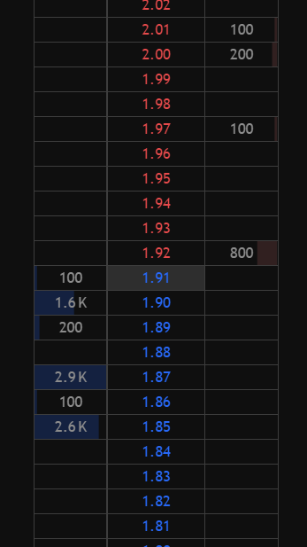
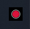
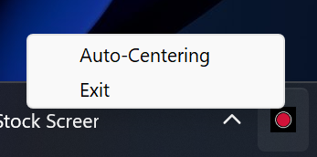
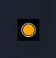
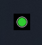

# TradingView DOM (Level 2) AUTO-CENTER



This script enhances the Desktop Version of TradingView by automating the centering of the Level 2 (Depth of Market, or DOM) view, a feature no longer natively supported. In fast-moving markets, manually scrolling or clicking the auto-center icon can be tedious. This Python-based system tray application solves this by automatically centering the DOM when active.

## Setup
### Prerequisites
- **Operating System**: Windows 11
- **Python Version**: Python 3.13
- **TradingView**: Desktop Version


### Installation Steps
1. **Install Python 3.13**:
   - Download the latest Python 3.13 installer from [python.org](https://www.python.org/downloads/).
   - Run the installer, ensuring you check the box to "Add Python to PATH" during installation.
   - Verify installation by opening a Command Prompt and typing `python --version` (or `python3 --version` if `python` doesn't work). You should see `Python 3.13.x`.

2. **Install Dependencies**:
   - Clone this repository or download the script file.
   - Open a Command Prompt, navigate to the script's directory, and run:
     ```
     pip install -r requirements.txt
     ```
   - The `requirements.txt` file includes only the necessary packages: `pystray`, `pillow`, `pyautogui`, and `pynput`.

## Usage

1. **Run the Script**:
   - Open a Command Prompt, navigate to the script's directory, and run:
     ```
     python domAutoCenter.py
     ```
2. **System Tray Icon**:
   - A new icon will appear in your system tray. 
   - **Right-click** the icon to open the menu. 

3. **Controls**:
   - Select "Auto-Centering" (to toggle activate/deactivate) or select "Exit" to stop the script.
   - **Icon States**:
     - **Red**: Script is running but auto-centering is deactivated.
     - **Orange**: Auto-centering is activated, but the script is not on a TradingView tab where DOM centering is applicable. 
     - **Green**: Auto-centering is activated and currently centering the DOM on an eligible TradingView tab. 

## What the Script Does
The script monitors the active window for TradingView (detected by specific title keywords like "%", "+", or "−"). When enabled and focused on a compatible TradingView tab, it automatically sends the `Shift + Alt + C` key combination to center the DOM at regular intervals, mimicking the manual auto-center action. It runs in the background via the system tray, updating its icon color to reflect its status. It does not interfere with core functionalities such as placing trades or other TradingView operations.

## Add to Windows Startup
To automatically start the script when your Windows machine boots, follow these steps:
1. **Create a Shortcut**:
   - Locate the `domAutoCenter.py` file in its directory.
   - Right-click the file, select "Create shortcut," and move the shortcut to a convenient location (e.g., your Desktop).
2. **Open Startup Folder**:
   - Press `Win + R`, type `shell:startup`, and press Enter. This opens the Startup folder for the current user.
3. **Add Shortcut**:
   - Drag the shortcut into the Startup folder, or copy and paste it there.
4. **(Optional) Edit Shortcut**:
   - Right-click the shortcut, select "Properties," and in the "Target" field, ensure it includes the full path to Python and the script, e.g., `"C:\Python313\python.exe" "C:\path\to\domAutoCenter.py"`. Adjust paths as needed.
   - Click "OK" to save.
5. **Test**:
   - Restart your computer to confirm the script starts automatically. The system tray icon should appear.

**Note**: Ensure Python is added to your system PATH during installation, or specify the full Python executable path in the shortcut.
